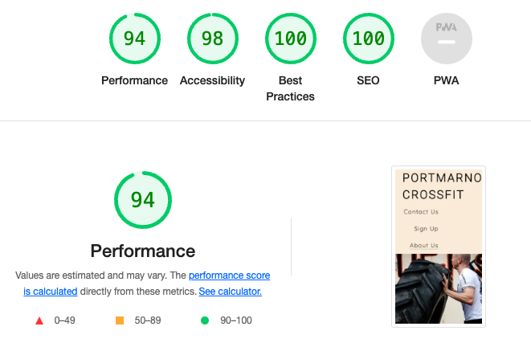

# Crossfit Portmarnock

This project was created thing about a traditional Crossfit Gym, where people can get fit, does not matter their age or how fit they are at the moment. 
I also want to highlight all benefits that the place’s facilities offers to your members and their families. As CrossFit is a sport that is much nicer if you practice with many friends, we can not forget to mention our promo “if you bring a friend you have 10% of discount”.

## FEATURES

### Crossfit Portmarnock:

Crossfit Portmarnock is a website made to show people that there is no specific age or physical condition to start to have a helthier life. 

### About Us:

In this session I just added 2 paragraphs explaining a little bit of the history of the place and also giving a general ideal of what people can find if join the gym.

### Bring a friend and get 10% of discount:

“Get a discount” always calls people attention, for this reason I decided to add this very small sentence over the main photo of our website. This way people will get curious about “how does it work?” and consequently, ask for more details.

### Sign up:

The sign-up area was created for the person who after check our website, decides to sign-up straight away and be part of the team (as a member). Mandatorily, the person has to add some info as first and last name, email address and phone number.

### Facilities:

In this session I decided to make a very direct propaganda about the facilities that the gym can offer to the members. This way we can easily can people’s attention to something that is not offered by most of our competitors in the market.

### Time-table: 

The very simple time table was created to show all possible future members and also to the ones who are already registered with us what time they can join the available classes.

### Mini Gallery:

In our mini gallery we can see different people, exercises and also equipments that usually you will see in a CrossFit gym. It is very important to show how CrossFit is a very dynamic activity and someone difficultly will get bored after a couple of months practicing this modality.

### Footer:

On our footer, we can find the place’s address, email address, phone number if they want to get in touch for any possible question and also all our different medias as Facebook page, Instagram, Youtube and Twitter.

### TESTING:

- I tested that this page works in different browsers: Chrome, Firefox, Safari.
- I confirm that this project is responsive, looks good and functions on all standard screen sizes using the dev tools device toolbar.
- I confirm that every field and button works.

#### Validator Testing:

- HTML: No errors were returned when passing through the official W3C validator
- CSS: No errors were found when passing through the official (Jigsaw) validator
    
#### Lighthouse Feature: 

To be implemented in the next version:
- Even after a session with my mentor we were not able to implement our "timetable" on the screen as planed, for this reason I decide to use "display: none" for this feature.

### DEPLOYMENT:

The site was deployed to GitHub pages. The steps to deploy are as follows:
- In the GitHub repository, navigate to the Settings tab
- From the source section drop-down menu, select the Master Branch
- Once the master branch has been selected, the page will be automatically refreshed with a detailed ribbon display to indicate the successful deployment.
- The live link can be found here - ADD FINAL PROJECT LINK LATER

### CREDITS:

* Fonts: Robots and Quicksand from https://fonts.google.com/ 
* Page Icon: https://iconarchive.com/
* Icons of the body’s page: https://fontawesome.com/
* All photos were took from: https://pxhere.com/
* This website was inspired on the project Love Running from CODE Institute
* Crossfit Portmarnock is not a real place and all info provided where created to be part of this website.
